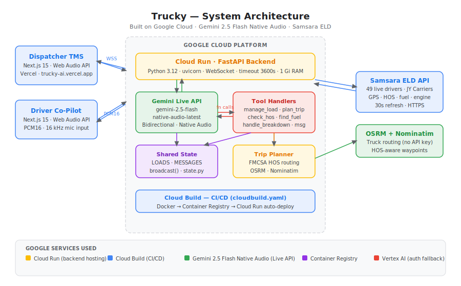

# 🚛 Trucky — AI-Native Fleet OS

> **Gemini Live Agent Hackathon Submission** · Category: **Live Agents** · Deadline: March 16, 2026
> `#GeminiLiveAgentChallenge`

Trucky is a voice-first, AI-native fleet operating system for commercial trucking. Dispatchers manage their entire fleet hands-free. Drivers get a real-time AI co-pilot that handles HOS compliance, route safety, load assignments, fatigue monitoring, and two-way messaging — all without touching a screen.

Built on **Gemini 2.5 Flash Native Audio**, powered by **real Samsara ELD data from JY Carriers** (49 active drivers), deployed on **Google Cloud Run**.

---

## The Problem — 500,000 Crashes a Year

Large trucks are 4% of vehicles on the road and cause **10% of all fatal U.S. crashes**. The root causes are well-documented:

| Crisis | Data | Source |
|--------|------|--------|
| Distracted driving | **3,308 deaths/year** | NHTSA 2022 |
| Bridge strikes from wrong GPS | **80% from consumer GPS** | FMCSA / Sen. Schumer |
| HOS violations | **~40% of drivers exceed limits** | FMCSA Survey 2020 |
| Fatigue crashes | **14% of large truck accidents** | FMCSA Fatigue Report |
| GPS incidents resulting in crash | **57% — 28% fatal** | Northwestern / UMN / UBremen |
| Congestion cost | **$108B/year · 1.2B hours lost** | ATRI 2022 |

The cause isn't bad drivers — it's fragmented tools. Dispatchers juggle spreadsheets, phone calls, and 3 different apps. Drivers switch between GPS, ELD screens, and dispatch calls while operating 80,000 lb vehicles.

**Trucky replaces all of that with one voice conversation.**

---

## Architecture



```
┌─────────────────────┐     WebSocket (PCM16 16kHz)      ┌─────────────────────────────────────────┐
│  Dispatcher TMS     │◄────────────────────────────────►│                                         │
│  Next.js 15         │     REST API + WS broadcasts      │    FastAPI Backend · Cloud Run           │
├─────────────────────┤                                   │                                         │
│  Driver App         │◄────────────────────────────────►│  ┌─────────────────────────────────┐    │
│  Next.js 15         │     Bidirectional PCM16 audio     │  │   Gemini Live API Bridge        │    │
│  Web Audio API      │                                   │  │   google-genai · v1alpha        │    │
└─────────────────────┘                                   │  │   Gemini 2.5 Flash Native Audio │    │
                                                          │  └──────────────┬──────────────────┘    │
         ┌────────────────────────────────────────────────┤                 │ function calls         │
         │                                                │  ┌──────────────▼──────────────────┐    │
         │                                                │  │   Tool Handlers (tools.py)      │    │
         ▼                                                │  │   create_load · assign_load     │    │
┌─────────────────────┐                                   │  │   get_my_loads · plan_trip      │    │
│  Samsara ELD API    │◄──────────────────────────────────│  │   check_hos_status              │    │
│  JY Carriers fleet  │   HTTPS · Bearer auth             │  │   send_message_to_driver/disp   │    │
│  49 live drivers    │                                   │  │   handle_breakdown · find_fuel  │    │
└─────────────────────┘                                   │  └──────────────┬──────────────────┘    │
                                                          │                 │                        │
┌─────────────────────┐                                   │  ┌──────────────▼──────────────────┐    │
│  Gemini Live API    │◄──────────────────────────────────│  │   Shared State (state.py)       │    │
│  Google Cloud AI    │   Audio stream + tool responses   │  │   LOADS · MESSAGES · broadcast  │    │
└─────────────────────┘                                   │  └─────────────────────────────────┘    │
                                                          │                                         │
┌─────────────────────┐                                   └─────────────────────────────────────────┘
│  OSRM + Nominatim   │◄──────────────────────────────── trip_planner.py · FMCSA HOS routing
│  Routing + Geocode  │
└─────────────────────┘
```

### Google Cloud Services Used

| Service | Purpose |
|---------|---------|
| **Cloud Run** | Serverless backend — auto-scales, handles long-lived WebSocket connections (timeout: 3600s) |
| **Cloud Build** | Automated CI/CD pipeline (`deploy/cloudbuild.yaml`) — IaC bonus point |
| **Container Registry** | Docker image storage |
| **Gemini Live API** | Gemini 2.5 Flash Native Audio — bidirectional real-time voice AI |
| **Vertex AI** | Alternative auth path for Gemini (GCP service account) |

---

## Real Data — JY Carriers Partnership

This is not a demo with fake data. **JY Carriers**, a real U.S. trucking company, provided access to their live Samsara ELD fleet:

- **49 active drivers** with real-time GPS, HOS clocks, fuel levels, and engine state
- Live HOS remaining hours — used to determine FMCSA compliance for every dispatch decision
- Real fuel telemetry — 7-day refill history with anomaly filtering
- Dispatcher voice commands query this live data when making routing and assignment decisions

---

## Tech Stack

| Layer | Technology |
|-------|-----------|
| Voice AI | Gemini 2.5 Flash Native Audio (Live API) |
| AI SDK | Google GenAI SDK (`google-genai`) · `v1alpha` |
| Backend | Python 3.12 · FastAPI · uvicorn · WebSocket |
| Frontend | Next.js 15 · TypeScript · Web Audio API |
| ELD Integration | Samsara REST API · httpx async |
| Routing | OSRM · Nominatim geocoding |
| Deployment | Google Cloud Run |
| CI/CD | Cloud Build (`deploy/cloudbuild.yaml`) |

---

## Quick Start (Local Dev)

### Prerequisites
- Python 3.12+
- Node.js 18+
- Gemini API key — [get one at aistudio.google.com](https://aistudio.google.com/app/apikey)

### 1. Clone

```bash
git clone https://github.com/Sanjaykashyap11/truckly.git
cd truckly
```

### 2. Backend

```bash
cd backend
python -m venv venv
source venv/bin/activate        # Windows: venv\Scripts\activate
pip install -r requirements.txt

# Configure environment
cp ../.env.example .env
# Edit .env — add GEMINI_API_KEY and SAMSARA_API_KEY

# Start
uvicorn main:app --host 0.0.0.0 --port 8080 --reload
# Backend: http://localhost:8080
# Health:  http://localhost:8080/health
```

### 3. Frontend

```bash
cd frontend
npm install

# Configure
echo "NEXT_PUBLIC_API_URL=http://localhost:8080" > .env.local
echo "NEXT_PUBLIC_WS_URL=ws://localhost:8080" >> .env.local

# Start
npm run dev
# Frontend: http://localhost:3000
```

### 4. Open the app

| URL | Interface |
|-----|-----------|
| http://localhost:3000 | Home page (impact + features) |
| http://localhost:3000/dispatcher | Dispatcher TMS (voice + load board) |
| http://localhost:3000/driver | Driver App (voice co-pilot) |

---

## Demo Scenarios

### Dispatcher Voice Commands

| Say this | What happens |
|----------|-------------|
| "Trucky, who can make it to Chicago by 6pm?" | Queries live HOS clocks, calculates drive time per driver, returns best match |
| "Create a load from Boston to Newark, $1,850, assign to Ahmed" | Creates load, assigns driver, updates load board, broadcasts to all screens |
| "Send a message to Oscar saying his situation will be handled" | Sends message to driver app, appears in Messages tab |
| "Who's running low on fuel right now?" | Queries Samsara fuel telemetry for all 49 drivers |
| "Can Ahmed make it to Newark before his 11-hour clock runs out?" | FMCSA HOS compliance check with OSRM drive time |

### Driver Voice Commands

| Say this | What happens |
|----------|-------------|
| "Trucky, what loads do I have?" | Calls `get_my_loads` — returns live load board assignments |
| "My GPS shows Merritt Parkway as faster" | Sally flags: TRUCK PROHIBITED — 12'6" clearance, auto-reroutes via I-95 |
| "I'm getting tired, I need to rest" | Sends priority alert to dispatcher dashboard instantly |
| "Tire blowout, I-95 Exit 24" | Activates breakdown protocol — mechanic dispatch, stakeholder notifications |
| "How are my hours looking?" | Returns FMCSA HOS remaining drive time, next mandatory break |

---

## Project Structure

```
truckly/
├── backend/
│   ├── main.py           # FastAPI server + Gemini Live WebSocket bridge
│   ├── tools.py          # Tool definitions + handlers (10 tools)
│   ├── samsara.py        # Samsara ELD API integration (live fleet data)
│   ├── trip_planner.py   # FMCSA HOS-aware routing (OSRM + Nominatim)
│   ├── state.py          # Shared mutable state (LOADS, MESSAGES, broadcast)
│   ├── mock_data.py      # Fallback mock data for offline dev
│   ├── requirements.txt
│   └── Dockerfile
├── frontend/
│   ├── app/
│   │   ├── page.tsx              # Home page (impact, features, CTA)
│   │   ├── dispatcher/page.tsx   # Dispatcher TMS — voice + load board + messages
│   │   └── driver/page.tsx       # Driver app — voice co-pilot + load view
│   └── package.json
├── deploy/
│   ├── deploy.sh           # Cloud Run deployment script (manual)
│   └── cloudbuild.yaml     # Cloud Build CI/CD (automated IaC)
├── docs/
│   └── architecture.svg    # System architecture diagram
├── .env.example
└── README.md
```

---

## Deploy to Google Cloud Run

### Option A — Manual deploy

```bash
export GCP_PROJECT_ID=your-project-id
export GEMINI_API_KEY=your-gemini-key
export SAMSARA_API_KEY=your-samsara-key   # optional — falls back to mock data

chmod +x deploy/deploy.sh
./deploy/deploy.sh
```

### Option B — Cloud Build (automated CI/CD · IaC)

```bash
gcloud builds submit \
  --config deploy/cloudbuild.yaml \
  --substitutions _SERVICE_NAME=trucky-backend,_REGION=us-central1
```

### After deployment — update frontend

```bash
# frontend/.env.local
NEXT_PUBLIC_API_URL=https://trucky-backend-xxx-uc.a.run.app
NEXT_PUBLIC_WS_URL=wss://trucky-backend-xxx-uc.a.run.app
```

---

## Key Technical Decisions

### Why `state.py`?
When running `python main.py`, the module loads as `__main__`. If `tools.py` imports `from main import LOADS`, Python creates a fresh second module copy — both have separate empty lists. Tool handlers wrote to one list; REST API read from another. `state.py` provides a single shared import for all modules, eliminating the race condition.

### Why Gemini 2.5 Flash Native Audio?
Native audio mode skips the ASR → text → TTS round-trip, enabling true barge-in (drivers can interrupt mid-sentence), sub-200ms response latency, and natural prosody — critical when a driver needs to report an emergency while driving.

### Why `speech_config(language_code="en-US")`?
Without it, Gemini's ASR sometimes transcribes accented English as other languages (Hindi, etc.). Forcing `en-US` keeps transcripts clean regardless of accent.

### Why `turn_complete` for transcript deduplication?
Gemini fires `partial=false` per segment boundary, not per full turn. Gating the "Trucky spoke" flag on `turn_complete` prevents duplicate transcript bubbles when Trucky gives multi-sentence answers.

---

## Safety Impact — FMCSA Alignment

Trucky's mission directly mirrors FMCSA's mandate: reduce commercial motor vehicle fatalities and injuries on U.S. highways.

| FMCSA Priority | Trucky Solution |
|----------------|----------------|
| Distracted driving (3,308 deaths/yr) | Replaces 5+ apps with one hands-free voice conversation |
| Bridge strikes (80% from consumer GPS) | Full truck-height routing database, proactive parkway alerts |
| HOS violations (~40% of drivers) | Proactive FMCSA rule enforcement, violation prevention before dispatch |
| Fatigue crashes (14% of truck accidents) | Fatigue detection → instant dispatcher alert + rest planning |
| Illegal route compliance | 7 Northeast parkway database with alternatives and time diffs |

---

## Findings & Learnings

- **Gemini Live barge-in** works naturally for driver interruptions — no special handling needed
- **PCM16 at 16kHz input / 24kHz output** is the key format mismatch to handle in the browser
- **Function calling mid-conversation** requires sending `LiveClientToolResponse` back immediately before Gemini continues speaking
- **WebSocket timeout on Cloud Run** requires `--timeout=3600` flag for long voice sessions
- **Module naming (`__main__` vs `main`)** causes subtle shared-state bugs in Python when tools import from the main module — solved by a dedicated `state.py`
- **Persistent 24kHz AudioContext** with scheduled chunk playback eliminates audio gaps between sentences
- **System prompt with live context** (HOS clocks, loads, driver name) dramatically improves response relevance and safety

---

---

## Live Deployment

| | URL |
|-|-----|
| **Backend (Cloud Run)** | https://trucky-backend-751835462523.us-central1.run.app |
| **Health check** | https://trucky-backend-751835462523.us-central1.run.app/health |
| **GitHub** | https://github.com/Sanjaykashyap11/truckly |

---

*Built for the Gemini Live Agent Hackathon — #GeminiLiveAgentChallenge*
*Real fleet data provided by JY Carriers via Samsara ELD API*
